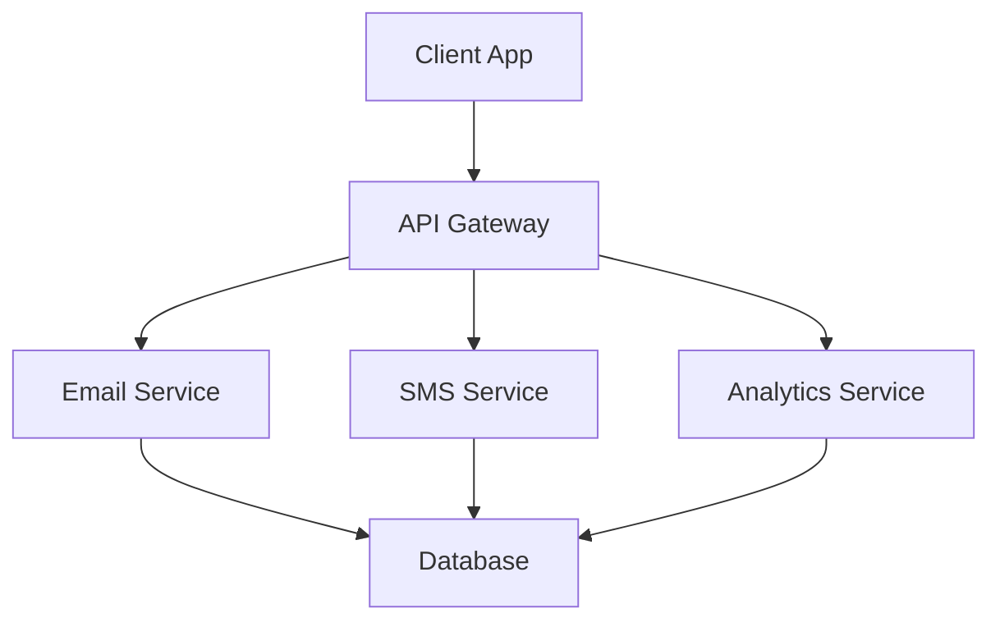

## Overview

Cheney Communications provides robust tools for modern communication needs. You manage workflows, leverage key service areas, understand the platform architecture, and handle user roles effectively. These core concepts form the foundation for using the platform to streamline your communications.

## Communication Workflows

Follow these sequential steps to set up and execute a typical communication workflow.

<Steps>
  <Step title="Define Audience" icon="users">
    Identify your target recipients using filters like location or preferences.
  </Step>
  <Step title="Craft Message" icon="edit-3">
    Design your content with templates for emails, SMS, or push notifications.
  </Step>
  <Step title="Schedule Delivery" icon="calendar">
    Set timing rules for optimal engagement.
  </Step>
  <Step title="Monitor Results" icon="bar-chart-3">
    Track open rates, clicks, and conversions in real-time dashboards.
  </Step>
</Steps>

<Callout kind="tip">
  Start with A/B testing in your first workflow to optimize performance quickly.
</Callout>

## Key Service Areas

Explore the main capabilities through these focused areas.

<Columns cols={2}>
  <Card title="Email Campaigns" icon="mail" href="/docs/email">
    Send personalized bulk emails with dynamic content and automation triggers.
  </Card>
  <Card title="SMS Messaging" icon="phone" href="/docs/sms">
    Deliver instant text messages for alerts, confirmations, and promotions.
  </Card>
  <Card title="Push Notifications" icon="bell" href="/docs/push">
    Engage mobile users with targeted in-app and web notifications.
  </Card>
  <Card title="Analytics" icon="activity" href="/docs/analytics">
    Gain insights from comprehensive reporting and segmentation tools.
  </Card>
</Columns>

## Platform Architecture

The platform follows a scalable, microservices-based design. Client applications connect via REST APIs to services handling messaging, scheduling, and analytics. A central database stores user data and campaign history.



This architecture ensures high availability and easy scaling. You interact primarily through the API gateway.

## User Roles and Permissions

Different roles grant specific access levels. Use the following tabs to review permissions.

<Tabs>
  <Tab title="Admin" icon="shield">
    Full access: Manage users, campaigns, billing, and platform settings.
    
    <CodeGroup tabs="API,CLI">
    ```javascript
    // Check role via API
    const userRole = await fetch('/api/user/role');
    console.log(userRole.role); // "admin"
    ```
    ```bash
    # CLI command
    cheney role check --user-id 123
    # Output: admin
    ```
    </CodeGroup>
  </Tab>
  <Tab title="Editor" icon="edit">
    Create and edit campaigns, view analytics, but no user management.
  </Tab>
  <Tab title="Viewer" icon="eye">
    Read-only access to campaigns and reports.
  </Tab>
</Tabs>

<Expandable title="Advanced Permissions" default-open="false">
  Customize permissions with granular controls like `campaign:delete` or `analytics:export`. Assign via the admin dashboard.
</Expandable>

## Integration Examples

Integrate Cheney Communications into your applications using these realistic code snippets.

<CodeGroup tabs="Node.js,Python">
```javascript
// Node.js integration
const cheney = require('cheney-sdk');
const client = new cheney.Client({ apiKey: 'YOUR_API_KEY' });

async function sendCampaign() {
  const result = await client.campaigns.send({
    to: ['user@example.com'],
    subject: 'Welcome!',
    body: 'Thank you for joining.'
  });
  console.log(result.id);
}
```
```python
# Python integration
from cheney import Client

client = Client(api_key='YOUR_API_KEY')

def send_campaign():
    result = client.campaigns.send(
        to=['user@example.com'],
        subject='Welcome!',
        body='Thank you for joining.'
    )
    print(result.id)
```
</CodeGroup>