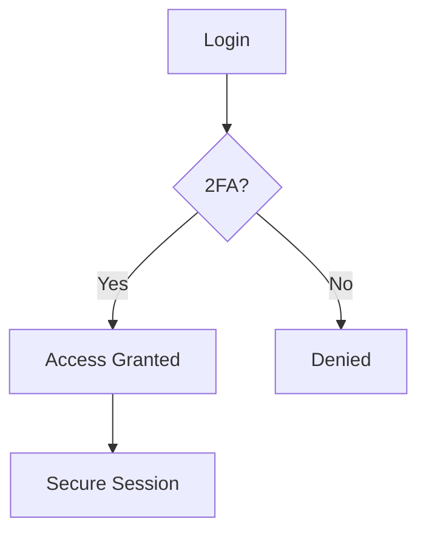

## Overview

Configure your Cheney Communications platform to match your specific requirements. Access the settings dashboard from the main navigation menu to manage profiles, notifications, integrations, and security. Follow these guides to optimize performance and ensure secure operations.

<Columns cols={2}>
  <Card title="Profile Management" icon="user" href="#profile-management">
    Update your user details and preferences.
  </Card>
  <Card title="Notifications" icon="bell" href="#notifications">
    Set up alerts for key events.
  </Card>
  <Card title="Integrations" icon="plug" href="#integrations">
    Connect with external services.
  </Card>
  <Card title="Security" icon="shield" href="#security">
    Protect your account and data.
  </Card>
</Columns>

## Profile and Settings Management

Customize your profile to reflect your communication needs. Start by navigating to the settings page.

<Steps>
  <Step title="Access Settings" icon="settings">
    Click your profile icon in the top-right corner and select `Settings`.
  </Step>
  <Step title="Update Profile" icon="edit">
    Enter your display name, email, and time zone. Save changes to apply immediately.
  </Step>
  <Step title="Set Preferences" icon="sliders">
    Choose theme (light/dark), language, and default channels.
  </Step>
</Steps>

| Setting          | Description                          | Default Value |
|------------------|--------------------------------------|---------------|
| Display Name     | Your visible name in communications | Your email    |
| Time Zone        | Local time for scheduling            | UTC           |
| Language         | Interface language                   | English       |

## Notification Preferences

Tailor notifications to avoid overload while staying informed. Use the preferences panel to enable or disable channels.

<Tabs>
  <Tab title="Email" icon="mail">
    Receive summaries and critical alerts via email.
    
    ```javascript
    // Enable email notifications via API
    await fetch('https://api.cheneycomms.com/notifications', {
      method: 'POST',
      headers: { 'Authorization': 'Bearer YOUR_TOKEN' },
      body: JSON.stringify({ channel: 'email', enabled: true })
    });
    ```
  </Tab>
  <Tab title="Push" icon="smartphone">
    Get instant mobile notifications for urgent messages.
    
    <Callout kind="tip">
      Enable push only for high-priority events to preserve battery life.
    </Callout>
  </Tab>
  <Tab title="In-App" icon="bell">
    Stay updated within the dashboard.
  </Tab>
</Tabs>

## Integration Basics

Connect Cheney Communications to your tools using API keys. Generate a key from the integrations tab.

<CodeGroup tabs="JavaScript,Python">
  ```javascript
  const apiKey = 'YOUR_API_KEY';
  const response = await fetch('https://api.cheneycomms.com/v1/channels', {
    headers: { 'X-API-Key': apiKey }
  });
  const channels = await response.json();
  console.log(channels);
  ```
  ```python
  import requests
  
  api_key = 'YOUR_API_KEY'
  response = requests.get(
      'https://api.cheneycomms.com/v1/channels',
      headers={'X-API-Key': api_key}
  )
  channels = response.json()
  print(channels)
  ```
</CodeGroup>

<ParamField header="X-API-Key" param-type="string" required="true">
  Your unique integration key. Keep it secret.
</ParamField>

## Security Configurations

Secure your account with these essential steps. Review settings regularly.

<Expandable title="Advanced Security Options" default-open="false">
  Enable two-factor authentication (2FA) and IP restrictions for added protection.
  
  ```bash
  # Verify 2FA setup
  cheney-config auth enable-2fa
  ```
</Expandable>

<Callout kind="alert">
  Never share your `{API_KEY}` or tokens. Rotate them every 90 days.
</Callout>



Follow these configurations to tailor Cheney Communications perfectly for your workflow. Test changes in a staging environment first.