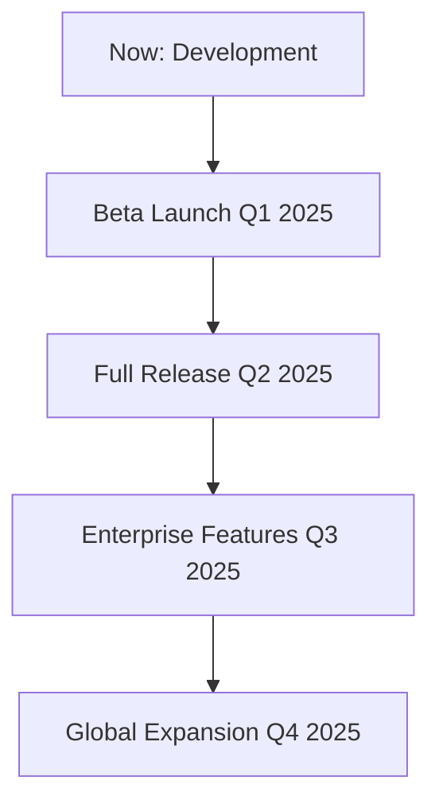

## Overview

Welcome to Cheney Communications. You join us at an exciting time as we build innovative solutions for modern communication needs. Our mission drives clear, reliable connections across digital platforms, while our vision shapes the future of seamless interactions.

<Callout kind="info">
Cheney Communications specializes in cutting-edge communication tools. Stay tuned for full service launches.
</Callout>

## Our Mission and Vision

You benefit from our commitment to excellence. We empower businesses and individuals with robust communication infrastructure.

<Columns cols={2}>
  <Card title="Mission" icon="target">
    Deliver innovative communication solutions that bridge gaps and foster collaboration.
  </Card>
  <Card title="Vision" icon="eye">
    Lead the industry in reliable, scalable communication technologies.
  </Card>
</Columns>

## Current Development Status

Our website and services are under active development. You see a `{coming soon}` message because we prioritize quality launches.

<Callout kind="tip">
Expect beta access invitations soon. Check back regularly for updates.
</Callout>

## Brand Identity

Embrace our brand color `#4462ec` for consistent visuals. Integrate it into your projects effortlessly.

<Tabs>
  <Tab title="CSS" icon="css3">
    Define the primary color in your stylesheet:

    ```css
    :root {
      --brand-primary: #4462ec;
    }

    .button {
      background-color: var(--brand-primary);
      color: white;
      padding: 12px 24px;
      border-radius: 6px;
    }
    ```
  </Tab>
  <Tab title="Tailwind" icon="tailwind">
    Add to your `tailwind.config.js`:

    ```javascript
    module.exports = {
      theme: {
        extend: {
          colors: {
            brand: {
              primary: '#4462ec',
            },
          },
        },
      },
    };
    ```

    Then use `bg-brand-primary text-white`.
  </Tab>
  <Tab title="JavaScript" icon="javascript">
    Set dynamically:

    ```javascript
    document.documentElement.style.setProperty('--brand-primary', '#4462ec');

    // Usage in styles
    const button = document.querySelector('.cta');
    button.style.backgroundColor = '#4462ec';
    ```
  </Tab>
</Tabs>

## Future Roadmap

Discover our planned milestones. You stay ahead by following these steps.

<Steps>
  <Step title="Beta Launch" icon="play">
    Access early features for testing and feedback.
  </Step>
  <Step title="Full Release" icon="check-circle">
    Roll out core communication services.
  </Step>
  <Step title="Enterprise Tools" icon="users">
    Introduce advanced integrations and scalability.
  </Step>
</Steps>

<Expandable title="Detailed Roadmap" default-open="false">



Key phases include API integrations, mobile apps, and AI-driven messaging.
</Expandable>

## Get Involved

Prepare to engage with Cheney Communications. Follow our progress and contribute ideas through upcoming channels. Your input shapes our services. Explore brand guidelines now and build with `#4462ec` for alignment.